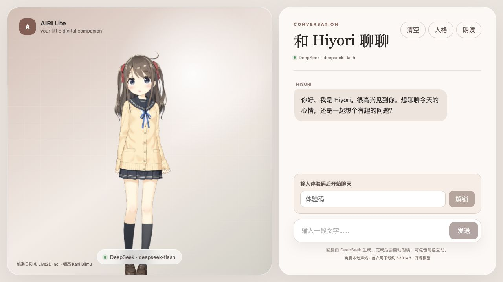
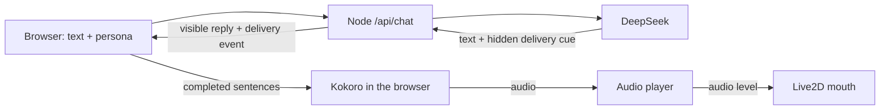

# AIRI Lite

A small, self-hosted Live2D companion inspired by [Project AIRI](https://github.com/moeru-ai/airi). Give Hiyori a basic persona, chat through DeepSeek, and hear her replies in a consistent local voice—without adding a microphone or reproducing AIRI's full stack.

**[Try the live demo](https://mmturingtest.online/airi/)** · Chat access currently requires an experience code.



<sub>Screenshot of the live demo. This content uses sample data owned and copyrighted by Live2D Inc. Hiyori Momose was illustrated by Kani Biimu. The sample is used under [Live2D's terms](https://www.live2d.com/eula/live2d-sample-model-terms_en.html); the application itself is independently authored. Model files are not included in this repository.</sub>

> 中文速览：这是一个精简的 AI 角色 demo，包含 Live2D 形象、可编辑人格、DeepSeek 文字对话、固定中文声线及随音量变化的口型。暂不支持麦克风输入，线上聊天需要体验码。

The first milestone is intentionally narrow:

- render a Live2D character;
- accept text input;
- reply with a configurable personality;
- read replies aloud without microphone access.

The demo renders **Hiyori Momose** with Live2D, streams replies from DeepSeek, lets each browser edit a basic persona, and speaks completed sentences with a fixed local Kokoro Chinese voice while later text is still arriving. Audio amplitude drives the Live2D mouth. Generated speech chunks can play before the whole reply finishes synthesizing, and the complete WAV remains available for replay afterward. A small delivery layer makes restrained changes to speech speed and facial parameters for short replies; this is not an expressive voice model. If local inference is unavailable, it falls back to browser text-to-speech. There is no microphone or speech recognition. The Hiyori artwork and this demo's configurable persona are separate from Project AIRI.

## What works today

| Area | Current behavior |
| --- | --- |
| Character | Hiyori Momose Live2D model with click interaction, basic mouth movement, and subtle delivery cues |
| Personality | Editable persona and opt-in user memory stored in the visitor's browser; recent chat survives refresh in the current tab |
| Brain | Server-side DeepSeek streaming, with an explicitly labelled local fallback when unconfigured |
| Voice | Fixed `zf_001` Kokoro Chinese voice with slight speed variation; browser speech fallback |
| Not yet built | Microphone input, learned emotional prosody, phoneme-level lip sync, automatic memory extraction, cross-device sync, and user accounts |

## How it fits together



The DeepSeek key stays on the server. Kokoro inference runs on the visitor's device; the VPS does not generate the audio. Speech can start when the first complete sentence arrives, but this is **not** a low-latency full-duplex voice chat. DeepSeek can choose a hidden `neutral`/`soft`/`bright`/`curious` delivery cue for each reply. The server removes it from visible text, then the browser uses it for restrained speed and Live2D face changes; untagged replies retain the local heuristic. This is still one fixed TTS voice, not trained expressive speech.

## Run locally

Requirements: Node.js 24+ and pnpm 10+.

1. Install dependencies with `pnpm install`.
2. Add the [Hiyori model](#hiyori-momose-model) and [Kokoro voice file](#local-voice-and-lip-sync); neither is committed to Git.
3. Optionally configure a [DeepSeek API key](#deepseek-setup) for real replies.
4. Start the app with `pnpm dev` and open <http://localhost:5173/airi/>.

The app must run through this local server; opening `index.html` directly will not provide the chat API. Without a DeepSeek key, the UI clearly marks generated text as a local fallback.

## DeepSeek setup

Create a local environment file:

```bash
cp .env.example .env.local
```

Open `.env.local` and set the key created in the [DeepSeek platform](https://platform.deepseek.com/):

```dotenv
DEEPSEEK_API_KEY=your_key_here
DEEPSEEK_BASE_URL=https://api.deepseek.com
DEEPSEEK_MODEL=deepseek-flash
```

Restart `pnpm dev` after changing the environment file. A green provider indicator means the local server found the key, **not** that an upstream request has already succeeded; an amber indicator means the app is using the clearly labelled local fallback.

The API key is read only by `server/index.mjs`. It is never added to the browser bundle or local storage, and `.env.local` is ignored by Git. Production startup requires a random, printable-ASCII `AIRI_DEMO_ACCESS_CODE` of at least 16 characters. The UI stores this code only in browser session storage. The server also rate-limits requests and caps concurrent upstream calls; these are small-demo controls, not a substitute for per-user accounts and billing limits.

Generation settings such as `DEEPSEEK_MAX_TOKENS` and `DEEPSEEK_TEMPERATURE` are documented in `.env.example`. The default model can be replaced without changing application code.

## Persona

Choose **人格** in the chat header to edit:

- character name;
- personality tendencies;
- background scenario;
- speaking style;
- behavioral boundaries;
- example dialogues that calibrate tone without becoming fixed lines;
- first greeting.

Persona settings are stored in the browser's local storage. They are sent to the local server with recent conversation history and compiled into the system message there. The design is a reduced version of AIRI's Character Card separation of personality, scenario, system instructions, greetings, and examples.

The default Hiyori persona favors concrete reactions over routine closing questions. The server also reminds the model that it cannot see browser tabs, the screen, surroundings, or live outside information, so a playful reply should not invent sensory evidence. Existing user-edited character cards are preserved when the default changes.

Recent conversation is temporarily kept in this browser tab's session storage so refreshing the page does not make Hiyori forget the current exchange. **清空** removes that stored transcript. The transcript is not shared across devices or stored as long-term memory; its current context is still sent to DeepSeek when generating a reply.

Choose **记忆** to manually save a short note about yourself (for example, a preferred name or response style). It remains in this browser's local storage across tabs and restarts until you remove it with **清除记忆** or clear browser data. Each new chat request sends this note to the local server and then to DeepSeek as context; it is not automatically extracted from conversation, shared across devices, or verified as fact. **清空** clears only the current tab's conversation, not the note. Avoid passwords and other sensitive information.

For a line you want to keep, use **记住这句…** beneath your own message. This only opens an editable memory draft; nothing is persisted until you review it and press **保存记忆**.

Run a production build with:

```bash
pnpm build
AIRI_DEMO_ACCESS_CODE=replace-with-a-long-random-code pnpm start
```

Run the Persona and server tests with `pnpm test`.

For a real-provider Persona spot check, `scripts/smoke-persona.mjs` accepts a JSON chat request on stdin and uses `AIRI_DEMO_ACCESS_CODE` from the server environment. It prints only the reply, not the code. Set `AIRI_SMOKE_SHOW_DELIVERY=1` to report the hidden delivery cue on stderr. This calls the paid DeepSeek API; a few good samples are not a human-likeness evaluation.

For local sentence-stream testing without provider charges, run `node scripts/mock-deepseek.mjs` in one terminal and `DEEPSEEK_API_KEY=mock DEEPSEEK_BASE_URL=http://127.0.0.1:4174 pnpm dev` in another. The page will show a configured provider because the mock uses the same API shape; its canned text is **not** a real DeepSeek reply. Stop both processes after testing.

## Hiyori Momose model

The model files are not redistributed by this repository; only the screenshot above is included. Review the [official Live2D sample page](https://www.live2d.com/en/learn/sample/momose-hiyori/) and [license terms](https://www.live2d.com/eula/live2d-sample-model-terms_en.html) first. Download the Simplified Chinese ZIP and copy the contents of `hiyori_free/runtime/` into `public/models/hiyori/`. The expected entrypoint is `public/models/hiyori/hiyori_free_t08.model3.json`. Build only after adding those files; Vite copies them into `dist/models/hiyori/`.

The app loads Cubism Core from Live2D's official URL at runtime. Internet access to that script is required. The application code and model artwork have separate licenses; the published page includes the sample's copyright/creator notice.

## Local voice and lip sync

The demo uses the Apache-2.0 [Kokoro Chinese model](https://huggingface.co/hexgrad/Kokoro-82M-v1.1-zh) through the [ONNX release](https://huggingface.co/onnx-community/Kokoro-82M-v1.1-zh-ONNX) and `@uzen/kokoro-js`. It uses the fixed `zf_001` voice. Download its voice data into the ignored path before building:

```bash
mkdir -p public/kokoro/voices
curl -fL https://huggingface.co/onnx-community/Kokoro-82M-v1.1-zh-ONNX/resolve/main/voices/zf_001.bin -o public/kokoro/voices/zf_001.bin
```

The ONNX model is **not** bundled in the repository or hosted on this VPS. On first use, each visitor's browser downloads the roughly 326 MB fp32 model directly from Hugging Face and caches it locally. The app tries WebGPU first and then WASM. Browser tests found that q4f16/WebGPU could return an all-zero waveform and q8/WASM could return invalid samples; fp32/WebGPU produced a non-silent WAV. This does not add a paid TTS API or VPS inference load, but it requires model-download access and a reasonably capable device. The app rejects silent output instead of presenting it as successful speech. Each complete sentence can start synthesizing while DeepSeek streams later text; raw token boundaries are buffered so names such as `DeepSeek` are normalized intact. During long replies the player progress resets for each generated chunk; after playback it holds the combined WAV for replay. If automatic playback is blocked, use the visible audio player's play button. The browser build currently fails on some English spans, so common terms are mapped to Chinese and remaining Latin words are spelled out on the same fixed voice. If model loading or synthesis fails before audio starts, the app attempts the browser's built-in voice and reports the fallback. Only Kokoro playback uses measured audio levels for the mouth; browser fallback retains the simpler speaking animation. DeepSeek chat still uses its paid API.

## Deployment

The current VPS uses the sample systemd unit in `deploy/airi-lite.service`: Node listens only on `127.0.0.1:3001`; Nginx forwards `/airi/` and disables proxy buffering for streamed replies. Keep the production `.env` outside Git and readable only by the service account. Check `GET /airi/api/health` for non-secret status, then test a chat with the access code. This route shares a domain with another app, but it runs as an independent service.

## Roadmap

1. Measure first-audio latency and speech gaps under real network conditions, then evaluate a genuinely expressive voice model; speed changes alone do not provide emotional prosody.
2. Add phoneme-level mouth shapes and more nuanced expressions; the current lip sync follows volume, not exact phonemes.
3. Add per-user accounts/quotas before opening unrestricted public chat.

## License

Source code in this repository is released under the MIT License. Live2D sample data is not included and is governed by its own terms. Hiyori Momose is a Live2D original character; her design must not be changed. This project is independently authored and is not affiliated with Live2D Inc. or Project AIRI.
