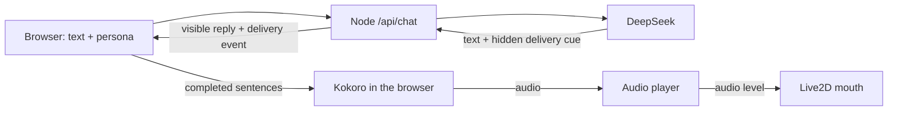

# AIRI Lite

A small, self-hosted Live2D companion inspired by [Project AIRI](https://github.com/moeru-ai/airi). Give Hiyori a basic persona, chat through DeepSeek, and hear her replies in a consistent local voice—without adding a microphone or reproducing AIRI's full stack.

**[Try the live demo](https://mmturingtest.online/airi/)** · Chat access currently requires an experience code.


<sub>Screenshot of the live demo. This content uses sample data owned and copyrighted by Live2D Inc. Hiyori Momose was illustrated by Kani Biimu. The sample is used under [Live2D's terms](https://www.live2d.com/eula/live2d-sample-model-terms_en.html); the application itself is independently authored. Model files are not included in this repository.</sub>

> 中文速览：这是一个精简的 AI 角色 demo，包含 Live2D 形象、可编辑人格、DeepSeek 文字对话、可选的固定中文声线及随音量和频谱变化的近似口型。暂不支持麦克风输入，线上聊天需要体验码。

The first milestone is intentionally narrow:

- render a Live2D character;
- accept text input;
- reply with a configurable personality;
- read replies aloud without microphone access.

The demo renders **Hiyori Momose** with Live2D, streams replies from DeepSeek, lets each browser edit a basic persona, and speaks completed sentences with one of three selectable fixed local Kokoro Chinese voices while later text is still arriving. Audio amplitude drives mouth opening, while a restrained spectral estimate varies mouth shape. Generated speech chunks can play before the whole reply finishes synthesizing, and the complete WAV remains available for replay afterward. A small delivery layer lets individual sentences have different, restrained speech speeds and facial cues, synchronized with actual audio playback. The voice remains a fixed TTS preset. If local inference is unavailable, it falls back to browser text-to-speech. There is no microphone or speech recognition. The Hiyori artwork and this demo's configurable persona are separate from Project AIRI.

## What works today

| Area | Current behavior |
| --- | --- |
| Character | Hiyori Momose Live2D model with click interaction, audio-synchronous mouth movement, and smoothly blended attention/thinking/speaking cues |
| Personality | Editable persona and opt-in user memory; up to 160 recent messages survive refresh in the current tab, subject to byte limits |
| Turn-taking | Visitors can draft a new message while Hiyori replies, then stop the current reply or speech before sending it |
| Brain | Server-side DeepSeek streaming, with an explicitly labelled local fallback when unconfigured |
| Voice | Three selectable Kokoro Chinese female presets (`zf_001`–`zf_003`) with slight speed variation; browser speech fallback |
| Not yet built | Microphone input, learned emotional prosody, phoneme-level lip sync, automatic memory extraction, cross-device sync, and user accounts |

## How it fits together



The DeepSeek key stays on the server. Kokoro inference runs on the visitor's device; the VPS does not generate the audio. Speech can start when the first complete sentence arrives, but this is **not** a low-latency full-duplex voice chat. DeepSeek chooses a hidden `neutral`/`soft`/`bright`/`curious` delivery cue at the start and may change it before a new sentence or paragraph when the tone changes. The server removes these markers from visible text. The browser queues each sentence with its cue, adjusts its synthesis speed slightly, and changes the Live2D face when that audio actually plays. Untagged replies retain the local heuristic. Each chosen preset remains a fixed TTS voice, not trained expressive speech.

## Run locally

Requirements: Node.js 24+ and pnpm 10+.

1. Install dependencies with `pnpm install`.
2. Add the [Hiyori model](#hiyori-momose-model) and [Kokoro voice files](#local-voice-and-lip-sync); neither is committed to Git.
3. Optionally configure a [DeepSeek API key](#deepseek-setup) for real replies.
4. Start the app with `pnpm dev` and open <http://localhost:5173/airi/>.

The app must run through this local server; opening `index.html` directly will not provide the chat API. Without a DeepSeek key, the UI clearly marks generated text as a local fallback.

## DeepSeek setup

Create a local environment file:

```bash
cp .env.example .env.local
```

Open `.env.local` and set the key created in the [DeepSeek platform](https://platform.deepseek.com/):

```dotenv
DEEPSEEK_API_KEY=your_key_here
DEEPSEEK_BASE_URL=https://api.deepseek.com
DEEPSEEK_MODEL=deepseek-flash
```

Restart `pnpm dev` after changing the environment file. A green provider indicator means the local server found the key, **not** that an upstream request has already succeeded; an amber indicator means the app is using the clearly labelled local fallback.

The API key is read only by `server/index.mjs`. It is never added to the browser bundle or local storage, and `.env.local` is ignored by Git. Production startup requires a random, printable-ASCII `AIRI_DEMO_ACCESS_CODE` of at least 16 characters. The UI stores this code only in browser session storage. The server also rate-limits requests and caps concurrent upstream calls; these are small-demo controls, not a substitute for per-user accounts and billing limits.

Generation settings such as `DEEPSEEK_MAX_TOKENS` and `DEEPSEEK_TEMPERATURE` are documented in `.env.example`. The default model can be replaced without changing application code.

## Persona

Choose **人格** in the chat header to edit:

- character name;
- personality tendencies;
- stable preferences and small habits;
- background scenario;
- speaking style;
- behavioral boundaries;
- example dialogues that calibrate tone without becoming fixed lines;
- first greeting.

Persona settings are stored in the browser's local storage. They are sent to the local server with recent conversation history and compiled into the system message there. The design is a reduced version of AIRI's Character Card separation of personality, scenario, system instructions, greetings, and examples.

The default Hiyori persona favors concrete reactions over routine closing questions. Her card now gives her stable preferences: strawberry-flavored, moderately sweet treats, upbeat J-pop, cooperative puzzles, and starting tasks with one small step. The server encourages her to acknowledge different tastes without immediately adopting the visitor's opinion; preferences are only brought up when relevant. They describe a digital character's tastes, not real meals, outings, or listening history. The server also reminds the model that it cannot see browser tabs, the screen, surroundings, or live outside information, so a playful reply should not invent sensory evidence.

Existing user-edited character cards are preserved when the default changes; an older custom card receives an empty preferences field rather than Hiyori's tastes. An unchanged previous default upgrades automatically. You can edit or clear **稳定偏好与小习惯** in **人格**, then save. Saving is temporarily unavailable while a reply is being generated, so the current turn retains the card it started with. A saved card applies to subsequent replies without deleting the conversation. These prompt controls guide the model; consistency should still be checked over multiple conversations.

Recent conversation is temporarily kept in this browser tab's session storage: up to 160 messages (roughly 80 short exchanges), capped at 512 KB of serialized UTF-8 data. Refreshing retains the original words and sentence delivery cues. **清空** removes that transcript. It is not shared across devices or copied into long-term memory.

The browser and server use the same context packer. Each request keeps a contiguous suffix of recent complete turns, including an unanswered latest user message; it does not skip a large turn and silently splice together unrelated older ones. Message context is capped at 80 KB and the full JSON packet at 120 KB, counting the persona, saved memory and JSON escaping. Long messages may therefore reduce how far back Hiyori can read. This replaces the previous hard cutoff of 24 messages and prevents a long visible conversation from growing into an oversized API request. It is bounded conversation context, not unlimited recall or an AI-generated summary. Messages over 8,000 characters are rejected before sending, leaving the draft intact rather than silently losing an ending correction.

If you explicitly correct something in the current conversation, the prompt gives that correction priority over an old saved note or the character's earlier guess. Hiyori is also told to distinguish her own suggestions from plans you actually accepted. Saved notes are not automatically rewritten; you stay in control through **记忆**.

Sentence-level delivery cues are kept with each reply in this tab, so **朗读** can regenerate the same cue sequence after refresh. The complete audio player's replay and seek also select the cue at the current playback time. Stopping cancels queued sentences as well as the current player; the avatar keeps a waiting pose while more audio is being prepared.

While a reply is being generated, you can type your next thought and choose **停下** to interrupt it. The unfinished assistant reply is removed from the visible and saved conversation; your own message and unsent draft remain. **停下** also stops active audio. This is a text-chat turn-taking control, not microphone barge-in.

Choose **记忆** to manually save a short note about yourself (for example, a preferred name or response style). It remains in this browser's local storage across tabs and restarts until you remove it with **清除记忆** or clear browser data. Each new chat request sends this note to the local server and then to DeepSeek as context; it is not automatically extracted from conversation, shared across devices, or verified as fact. **清空** clears only the current tab's conversation, not the note. Avoid passwords and other sensitive information.

For a line you want to keep, use **记住这句…** beneath your own message. This only opens an editable memory draft; nothing is persisted until you review it and press **保存记忆**.

Run a production build with:

```bash
pnpm build
AIRI_DEMO_ACCESS_CODE=replace-with-a-long-random-code pnpm start
```

Run the Persona and server tests with `pnpm test`.

For a real-provider Persona spot check, `scripts/smoke-persona.mjs` accepts a JSON chat request on stdin and uses `AIRI_DEMO_ACCESS_CODE` from the server environment. It prints only the reply, not the code. Set `AIRI_SMOKE_SHOW_DELIVERY=1` to report the last delivery cue, or `AIRI_SMOKE_SHOW_CUES=1` for all cues and their visible-text offsets on stderr. This calls the paid DeepSeek API; a few good samples are not a human-likeness evaluation.

For local sentence-stream testing without provider charges, run `node scripts/mock-deepseek.mjs` in one terminal and `DEEPSEEK_API_KEY=mock DEEPSEEK_BASE_URL=http://127.0.0.1:4174 pnpm dev` in another. The page will show a configured provider because the mock uses the same API shape; its canned text is **not** a real DeepSeek reply. Stop both processes after testing.

## Hiyori Momose model

The model files are not redistributed by this repository; only the screenshot above is included. Review the [official Live2D sample page](https://www.live2d.com/en/learn/sample/momose-hiyori/) and [license terms](https://www.live2d.com/eula/live2d-sample-model-terms_en.html) first. Download the Simplified Chinese ZIP and copy the contents of `hiyori_free/runtime/` into `public/models/hiyori/`. The expected entrypoint is `public/models/hiyori/hiyori_free_t08.model3.json`. Build only after adding those files; Vite copies them into `dist/models/hiyori/`.

The app loads Cubism Core from Live2D's official URL at runtime. Internet access to that script is required. The application code and model artwork have separate licenses; the published page includes the sample's copyright/creator notice.

## Local voice and lip sync

The demo uses the Apache-2.0 [Kokoro Chinese model](https://huggingface.co/hexgrad/Kokoro-82M-v1.1-zh) through the [ONNX release](https://huggingface.co/onnx-community/Kokoro-82M-v1.1-zh-ONNX) and `@uzen/kokoro-js`. Choose **声线** in the chat header to audition and save one of three fixed Chinese female presets on this browser. Download all three voice files into the ignored path before building:

```bash
mkdir -p public/kokoro/voices
curl -fL https://huggingface.co/onnx-community/Kokoro-82M-v1.1-zh-ONNX/resolve/main/voices/zf_001.bin -o public/kokoro/voices/zf_001.bin
curl -fL https://huggingface.co/onnx-community/Kokoro-82M-v1.1-zh-ONNX/resolve/main/voices/zf_002.bin -o public/kokoro/voices/zf_002.bin
curl -fL https://huggingface.co/onnx-community/Kokoro-82M-v1.1-zh-ONNX/resolve/main/voices/zf_003.bin -o public/kokoro/voices/zf_003.bin
```

These are existing presets, not a custom-trained or cloned voice. Choosing one does not add learned emotional prosody.

The ONNX model is **not** bundled in the repository or hosted on this VPS. On first use, each visitor's browser downloads the roughly 326 MB fp32 model directly from Hugging Face and caches it locally. The app tries WebGPU first and then WASM. Browser tests found that q4f16/WebGPU could return an all-zero waveform and q8/WASM could return invalid samples; fp32/WebGPU produced a non-silent WAV. This does not add a paid TTS API or VPS inference load, but it requires model-download access and a reasonably capable device. The app rejects silent output instead of presenting it as successful speech. Each complete sentence can start synthesizing while DeepSeek streams later text; raw token boundaries are buffered so names such as `DeepSeek` are normalized intact. During long replies the player progress resets for each generated chunk; after playback it holds the combined WAV for replay. If automatic playback is blocked, use the visible audio player's play button. The browser build currently fails on some English spans, so common terms are mapped to Chinese and remaining Latin words are spelled out on the same fixed voice. If model loading or synthesis fails before audio starts, the app attempts the browser's built-in voice and reports the fallback. Only Kokoro playback uses measured audio levels for the mouth; browser fallback retains the simpler speaking animation. DeepSeek chat still uses its paid API.

Kokoro playback samples the generated audio at 40 mouth frames per second. Volume controls opening; a bounded low/mid-frequency estimate adds small mouth-form changes. The positions follow playback time, including pause and replay, but are only an audio-driven approximation: Kokoro exposes phonemes without their timing, so this is **not** phoneme-level alignment or validated viseme recognition.

The avatar adds restrained attention cues while the input is focused, a thinking pose while a reply is pending, and small head movements during speech. These react to UI state, not cameras or observation of the visitor. Expressions fade between states; soft delivery also tones down the idle animation's blush and smiling eyes. Additional head movement respects `prefers-reduced-motion` (the model's original idle motion remains). Mouth and facial controls are applied just before Cubism updates its vertices, after idle motions, so idle animation cannot overwrite the speaking mouth or leave it open in silence.

For local render-order checks, run the development server and open `/airi/scripts/avatar-preview.html`. It uses the actual Hiyori model and production performance controller, with fixed open/closed poses, expression controls, an idle-motion replay, and pre-render parameter assertions. It does not use the LLM or play audio and is not part of the production build.

For a real Kokoro/Live2D playback check, open `/airi/scripts/speech-preview.html` in development. It plays three fixed sentences with bright, soft and curious cues and shows the cues emitted by the actual player; replay the combined WAV to check its audio timeline. This page is also excluded from production builds.

For long-context checks, open `/airi/scripts/continuity-preview.html` in a fresh development tab. Its clearly labelled synthetic fixtures use the actual transcript storage and request packer. Preparing a fixture replaces that tab's conversation; it does not call DeepSeek or touch long-term memory. Follow its link to the demo and send the displayed question to test the real API path (or the local mock). This diagnostic page is excluded from production builds too.

## Deployment

The current VPS uses the sample systemd unit in `deploy/airi-lite.service`: Node listens only on `127.0.0.1:3001`; Nginx forwards `/airi/` and disables proxy buffering for streamed replies. Keep the production `.env` outside Git and readable only by the service account. Check `GET /airi/api/health` for non-secret status, then test a chat with the access code. This route shares a domain with another app, but it runs as an independent service.

## Roadmap

1. Measure first-audio latency and speech gaps under real network conditions, then evaluate a genuinely expressive voice model; speed changes alone do not provide emotional prosody.
2. Evaluate phoneme-level alignment and more nuanced expressions; the current lip sync follows audio volume and spectral colour, not exact phoneme timestamps.
3. Add per-user accounts/quotas before opening unrestricted public chat.

## License

Source code in this repository is released under the MIT License. Live2D sample data is not included and is governed by its own terms. Hiyori Momose is a Live2D original character; her design must not be changed. This project is independently authored and is not affiliated with Live2D Inc. or Project AIRI.
