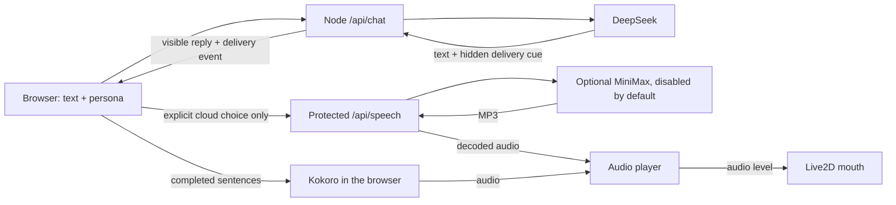

# AIRI Lite

A small, self-hosted Live2D companion inspired by [Project AIRI](https://github.com/moeru-ai/airi). Give Hiyori a basic persona, chat through DeepSeek, and hear her replies in a consistent local voice—without adding a microphone or reproducing AIRI's full stack.

**[Try the live demo](https://mmturingtest.online/airi/)** · Chat access currently requires an experience code.


<sub>Screenshot of the live demo. This content uses sample data owned and copyrighted by Live2D Inc. Hiyori Momose was illustrated by Kani Biimu. The sample is used under [Live2D's terms](https://www.live2d.com/eula/live2d-sample-model-terms_en.html); the application itself is independently authored. Model files are not included in this repository.</sub>

> 中文速览：这是一个精简的 AI 角色 demo，包含 Live2D 形象、可编辑人格、DeepSeek 文字对话、可选的固定中文声线及随音量和频谱变化的近似口型。暂不支持麦克风输入，线上聊天需要体验码。

The first milestone is intentionally narrow:

- render a Live2D character;
- accept text input;
- reply with a configurable personality;
- read replies aloud without microphone access.

The demo renders **Hiyori Momose** with Live2D, streams replies from DeepSeek, lets each browser edit a basic persona, and speaks completed sentences with one of three selectable fixed local Kokoro Chinese voices while later text is still arriving. Audio amplitude drives mouth opening, while a restrained spectral estimate varies mouth shape. Generated speech chunks can play before the whole reply finishes synthesizing, and the complete WAV remains available for replay afterward. A small delivery layer lets individual sentences have different, restrained speech speeds and facial cues, synchronized with actual audio playback. The voice remains a fixed TTS preset. If local inference is unavailable, it falls back to browser text-to-speech. There is no microphone or speech recognition. The Hiyori artwork and this demo's configurable persona are separate from Project AIRI.

## What works today

| Area | Current behavior |
| --- | --- |
| Character | Hiyori Momose Live2D model with click interaction, audio-synchronous mouth movement, and smoothly blended attention/thinking/speaking cues |
| Render budget | Independent character update/render ticker; 30fps/lower pixel budget on explicit saving or low-device hints, otherwise 60fps ceiling; hidden pages stop this character's rendering and interaction ticker |
| Personality | Editable persona and opt-in user memory; up to 160 recent messages survive refresh in the current tab, subject to byte limits |
| Turn-taking | Interruptible replies, a brief visual acknowledgement when sending, and streaming chat that follows the latest text without pulling visitors away from older messages |
| Brain | Server-side DeepSeek streaming, with an explicitly labelled local fallback when unconfigured |
| Voice | Auto/local/lightweight modes; three Kokoro Chinese presets; optional server-side MiniMax Speech 2.8 adapter, disabled until explicitly configured |
| Not yet built or validated | Microphone input, phoneme-level lip sync, automatic memory extraction, cross-device sync, user accounts, and real-provider emotional-voice quality/latency evaluation |

## How it fits together



The DeepSeek key stays on the server. Kokoro inference runs on the visitor's device; the VPS does not generate the audio. Speech can start when the first complete sentence arrives, but this is **not** a low-latency full-duplex voice chat. DeepSeek chooses a hidden `neutral`/`soft`/`bright`/`curious` delivery cue at the start and may change it before a new sentence or paragraph when the tone changes. The server removes these markers from visible text. The browser queues each sentence with its cue, adjusts its synthesis speed slightly, and changes the Live2D face when that audio actually plays. Untagged replies retain the local heuristic. Each chosen preset remains a fixed TTS voice, not trained expressive speech.

The optional cloud path uses the same sentence/playback controller. Enabling the server alone never silently switches visitors to a new provider: each visitor must explicitly select cloud mode. The lightweight browser mode uses system voices and a simpler speaking animation, not measured audio-driven mouth movement.

## Run locally

Requirements: Node.js 24+ and pnpm 10+.

1. Install dependencies with `pnpm install`.
2. Add the [Hiyori model](#hiyori-momose-model) and [Kokoro voice files](#local-voice-and-lip-sync); neither is committed to Git.
3. Optionally configure a [DeepSeek API key](#deepseek-setup) for real replies.
4. Start the app with `pnpm dev` and open <http://localhost:5173/airi/>.

The app must run through this local server; opening `index.html` directly will not provide the chat API. Without a DeepSeek key, the UI clearly marks generated text as a local fallback.

## DeepSeek setup

Create a local environment file:

```bash
cp .env.example .env.local
```

Open `.env.local` and set the key created in the [DeepSeek platform](https://platform.deepseek.com/):

```dotenv
DEEPSEEK_API_KEY=your_key_here
DEEPSEEK_BASE_URL=https://api.deepseek.com
DEEPSEEK_MODEL=deepseek-flash
```

Restart `pnpm dev` after changing the environment file. A green provider indicator means the local server found the key, **not** that an upstream request has already succeeded; an amber indicator means the app is using the clearly labelled local fallback.

The API key is read only by `server/index.mjs`. It is never added to the browser bundle or local storage, and `.env.local` is ignored by Git. Production startup requires a random, printable-ASCII `AIRI_DEMO_ACCESS_CODE` of at least 16 characters. The UI stores this code only in browser session storage. The server also rate-limits requests and caps concurrent upstream calls; these are small-demo controls, not a substitute for per-user accounts and billing limits.

Generation settings such as `DEEPSEEK_MAX_TOKENS` and `DEEPSEEK_TEMPERATURE` are documented in `.env.example`. The default model can be replaced without changing application code.

## Persona

Choose **设置 → 角色人格** in the chat header to edit:

- character name;
- personality tendencies;
- stable preferences and small habits;
- background scenario;
- speaking style;
- behavioral boundaries;
- example dialogues that calibrate tone without becoming fixed lines;
- first greeting.

Persona settings are stored in the browser's local storage. They are sent to the local server with recent conversation history and compiled into the system message there. The design is a reduced version of AIRI's Character Card separation of personality, scenario, system instructions, greetings, and examples.

The default Hiyori persona favors concrete reactions over routine closing questions. Her card now gives her stable preferences: strawberry-flavored, moderately sweet treats, upbeat J-pop, cooperative puzzles, and starting tasks with one small step. The server encourages her to acknowledge different tastes without immediately adopting the visitor's opinion; preferences are only brought up when relevant. They describe a digital character's tastes, not real meals, outings, or listening history. The server also reminds the model that it cannot see browser tabs, the screen, surroundings, or live outside information, so a playful reply should not invent sensory evidence.

Her default examples also include ordinary short responses, owning a conversational misstep, and giving code without extra banter when asked. Sharing or venting is not automatically a request for advice; an explicit request to stop advising or comforting should change that turn, not merely change the wording of the advice. These are prompt tendencies, not enforced guarantees. A [small before/after diagnostic](docs/reviews/2026-10-01-persona/README.md) preserves the sampled replies and review limits.

Existing user-edited character cards are preserved when the default changes; an older custom card receives an empty preferences field rather than Hiyori's tastes. An unchanged previous default upgrades automatically. You can edit or clear **稳定偏好与小习惯** in **人格**, then save. Saving is temporarily unavailable while a reply is being generated, so the current turn retains the card it started with. A saved card applies to subsequent replies without deleting the conversation. These prompt controls guide the model; consistency should still be checked over multiple conversations.

Recent conversation is temporarily kept in this browser tab's session storage: up to 160 messages (roughly 80 short exchanges), capped at 512 KB of serialized UTF-8 data. Refreshing retains the original words and sentence delivery cues. **清空** removes that transcript. It is not shared across devices or copied into long-term memory.

The browser and server use the same context packer. Each request keeps a contiguous suffix of recent complete turns, including an unanswered latest user message; it does not skip a large turn and silently splice together unrelated older ones. Message context is capped at 80 KB and the full JSON packet at 120 KB, counting the persona, saved memory and JSON escaping. Long messages may therefore reduce how far back Hiyori can read. This replaces the previous hard cutoff of 24 messages and prevents a long visible conversation from growing into an oversized API request. It is bounded conversation context, not unlimited recall or an AI-generated summary. Messages over 8,000 characters are rejected before sending, leaving the draft intact rather than silently losing an ending correction.

If you explicitly correct something in the current conversation, the prompt gives that correction priority over an old saved note or the character's earlier guess. Hiyori is also told to distinguish her own suggestions from plans you actually accepted. Saved notes are not automatically rewritten; you stay in control through **记忆**.

Sentence-level delivery cues are kept with each reply in this tab, so **朗读** can regenerate the same cue sequence after refresh. The complete audio player's replay and seek also select the cue at the current playback time. Stopping cancels queued sentences as well as the current player; the avatar keeps a waiting pose while more audio is being prepared.

While a reply is being generated, you can type your next thought and choose **停下** to interrupt it. Already-visible assistant text stays in the conversation, marked **已停下**, and is retained as the actual partial reply in later chat context and on refresh. An empty waiting placeholder is removed. Your own message and unsent draft remain, and queued sentences and active audio are stopped. Stopping does not retract something Hiyori has already said or silently turn a partial reply into a complete one. This is a text-chat turn-taking control, not microphone barge-in.

Choose **设置 → 个人记忆** to manually save a short note about yourself (for example, a preferred name or response style). It remains in this browser's local storage across tabs and restarts until you remove it with **清除记忆** or clear browser data. Each new chat request sends this note to the local server and then to DeepSeek as context; it is not automatically extracted from conversation, shared across devices, or verified as fact. **清空当前对话** clears only the current tab's conversation, not the note. Avoid passwords and other sensitive information.

For a line you want to keep, use **记住这句…** beneath your own message. This only opens an editable memory draft; nothing is persisted until you review it and press **保存记忆**.

Run a production build with:

```bash
pnpm build
AIRI_DEMO_ACCESS_CODE=replace-with-a-long-random-code pnpm start
```

Run the Persona and server tests with `pnpm test`.

For a real-provider Persona spot check, `scripts/smoke-persona.mjs` accepts a JSON chat request on stdin and uses `AIRI_DEMO_ACCESS_CODE` from the server environment. It prints only the reply, not the code. Set `AIRI_SMOKE_SHOW_DELIVERY=1` to report the last delivery cue, or `AIRI_SMOKE_SHOW_CUES=1` for all cues and their visible-text offsets on stderr. This calls the paid DeepSeek API; a few good samples are not a human-likeness evaluation.

`scripts/persona-spotcheck.mjs` accepts `{ "persona": { ... }, "cases": [{ "id": "...", "messages": [ ... ] }] }` on stdin (1–8 unique cases; optional `userMemory`). It validates the whole batch before network access, reads the sibling health endpoint, then requests cases serially with a 90-second timeout each. Run it on the server with `node --env-file=.env scripts/persona-spotcheck.mjs < your-synthetic-cases.json`; use only synthetic, non-private contexts for public artifacts. The access code comes from the environment, never the input or recorded JSONL. `AIRI_SMOKE_URL` defaults to the loopback chat endpoint. Records contain normalized context, visible text, the health-reported requested model, timestamp and application NDJSON events—not provider-native usage or proof of the exact upstream model revision. An error/incomplete stream is recorded when parsable, then the process exits nonzero and stops the batch; such a row is not a successful sample. HTTP/network failures and malformed NDJSON also fail. Check the exit status before reviewing or aggregating samples. Tests inject fake fetches and never call DeepSeek.

For local sentence-stream testing without provider charges, run `node scripts/mock-deepseek.mjs` in one terminal and `DEEPSEEK_API_KEY=mock DEEPSEEK_BASE_URL=http://127.0.0.1:4174 pnpm dev` in another. The page will show a configured provider because the mock uses the same API shape; its canned text is **not** a real DeepSeek reply. Stop both processes after testing.

## Hiyori Momose model

The model files are not redistributed by this repository; only the screenshot above is included. Review the [official Live2D sample page](https://www.live2d.com/en/learn/sample/momose-hiyori/) and [license terms](https://www.live2d.com/eula/live2d-sample-model-terms_en.html) first. Download the Simplified Chinese ZIP and copy the contents of `hiyori_free/runtime/` into `public/models/hiyori/`. The expected entrypoint is `public/models/hiyori/hiyori_free_t08.model3.json`. Build only after adding those files; Vite copies them into `dist/models/hiyori/`.

The app loads Cubism Core from Live2D's official URL at runtime. Internet access to that script is required. The application code and model artwork have separate licenses; the published page includes the sample's copyright/creator notice.

### Rendering on different devices

Live2D uses its own PIXI ticker for both model updates and rendering, rather than adding a second model update on PIXI's shared ticker. Reported memory ≤4 GB, ≤2 cores, or data-saving mode selects a 30fps ceiling, resolution capped at 1.25 and no antialiasing; other/unknown hints select 60fps and resolution capped at 2. Missing WebGPU is **not** treated as a weak WebGL GPU. These hints stay on the device and are a saving policy, not measured hardware performance or a guaranteed frame rate.

While the document is hidden, this app stops its render/model ticker and its own interaction subscription; global PIXI tickers are untouched. Returning starts a fresh bounded frame delta, not a replay of hidden time. This does not stop speech, pause the audio player or prevent provider billing. Reduced-motion settings continue to limit added gestures while retaining audio mouth control. Container changes resize the actual canvas buffer through ResizeObserver, including changes without a window resize.

Unmount/cancellation releases the canvas immediately; the dependency's model loading is not network-abortable, so a late or partially initialized model is cleaned up when loading settles. Shared CPU image textures remain in PIXI's finite URL cache for reuse; renderer-local GPU textures/context listeners are released without invalidating another mount. The dependency still has internal failure limitations, including a combined moc/texture rejection and failures inside core construction. This is not a claim that every possible dependency failure or all browser memory has been eliminated.

For local verification, open `/airi/scripts/avatar-preview.html` after `pnpm dev`: it compares actual model-update, Cubism and WebGL render counts at 30/60fps and can play the fixed Kokoro test lines. Its synthetic visibility button is labelled as an interface test, **not** a real background-tab or physical-phone test. `/airi/scripts/avatar-lifecycle-preview.html` exercises the production mount's cancellation, container resize, repeat destruction and delayed-old/new shared-texture race. These pages are development-only and are not entries in the production build. See [the rendering verification record](docs/verification/2026-10-01-avatar-rendering.md).

## Local voice and lip sync

The demo uses the Apache-2.0 [Kokoro Chinese model](https://huggingface.co/hexgrad/Kokoro-82M-v1.1-zh) through the [ONNX release](https://huggingface.co/onnx-community/Kokoro-82M-v1.1-zh-ONNX) and `@uzen/kokoro-js`. Choose **设置 → 选择声线** to audition and save one of three fixed Chinese female presets on this browser. Download all three voice files into the ignored path before building:

```bash
mkdir -p public/kokoro/voices
curl -fL https://huggingface.co/onnx-community/Kokoro-82M-v1.1-zh-ONNX/resolve/main/voices/zf_001.bin -o public/kokoro/voices/zf_001.bin
curl -fL https://huggingface.co/onnx-community/Kokoro-82M-v1.1-zh-ONNX/resolve/main/voices/zf_002.bin -o public/kokoro/voices/zf_002.bin
curl -fL https://huggingface.co/onnx-community/Kokoro-82M-v1.1-zh-ONNX/resolve/main/voices/zf_003.bin -o public/kokoro/voices/zf_003.bin
```

These are existing presets, not a custom-trained or cloned voice. Choosing one does not add learned emotional prosody.

The **语音方式** selector also has **自动**, **固定本地**, **轻量**, and optional **云端** choices. Auto is a conservative device-hint policy, not a speed benchmark: data-saving mode, reported memory ≤4 GB, ≤2 cores, or absent WebGPU selects browser speech; unknown hints default to local Kokoro. Explicit local mode still permits WASM on devices without WebGPU. Auto never selects MiniMax, even when the server has credentials. Device hints stay in the browser. Lightweight mode does not download Kokoro and cannot guarantee a consistent voice or emotional delivery across systems. Some system speech voices themselves use network services; browser speech is not a promise of fully offline synthesis.

Speech uses a separate, incremental spoken-text path: fenced code blocks and Markdown image syntax are omitted; links speak their labels instead of destinations; heading/list/quote/emphasis markers are removed and inline code keeps its text. Bare HTTP(S) URLs become a single “网址”. This is a conservative speech filter, not a full Markdown renderer, and the displayed reply/history are unchanged. Both Kokoro and browser fallback use it, including replay. Replies containing only code, images, emoji or punctuation have no spoken body: the app explains that visually and does not load the large voice model for that reply. Ordinary replies start preparing the voice after the first readable sentence; explicit voice auditions still load it. Skipping code does not create a silent waveform or invent a spoken summary. Original visible-text offsets remain the source of delivery cues even when some content is omitted.

The speech filter does not interpret arbitrary HTML, tables, four-space-indented code, or reference-definition lines. It intentionally suppresses unfinished fenced blocks and link destinations. This improves what the character reads, not the emotional range of the fixed voice.

The ONNX model is **not** bundled in the repository or hosted on this VPS. In local mode, the visitor's browser downloads the roughly 326 MB fp32 model directly from Hugging Face on first use and caches it locally. The app tries WebGPU first and then WASM. Browser tests found that q4f16/WebGPU could return an all-zero waveform and q8/WASM could return invalid samples; fp32/WebGPU produced a non-silent WAV. This local path does not add a paid TTS API or VPS inference load, but it requires model-download access and a reasonably capable device. The app rejects silent output instead of presenting it as successful speech.

Each complete sentence can start synthesizing while DeepSeek streams later text; raw token boundaries are buffered so names such as `DeepSeek` are normalized intact. During long replies the player progress resets for each generated chunk; after playback it holds the combined WAV for replay. If automatic playback is blocked, use the visible audio player's play button. The Kokoro browser build currently fails on some English spans, so common terms are mapped to Chinese and remaining Latin words are spelled out on that fixed local voice. This workaround is not applied to cloud speech.

If local model loading or synthesis fails before any valid clip is generated, the app attempts the browser's built-in voice and reports the fallback. Kokoro and decoded cloud playback use measured audio levels for the mouth; browser speech retains the simpler speaking animation. DeepSeek chat still uses its paid API.

Kokoro playback samples the generated audio at 40 mouth frames per second. Volume controls opening; a bounded low/mid-frequency estimate adds small mouth-form changes. The positions follow playback time, including pause and replay, but are only an audio-driven approximation: Kokoro exposes phonemes without their timing, so this is **not** phoneme-level alignment or validated viseme recognition.

The avatar adds restrained attention cues while the input is focused and a thinking pose while a reply is pending. Its added speaking gesture is a small pitch-only emphasis triggered by rises in the measured audio envelope, with a 400 ms cooldown and at most 0.9 degrees of offset; it is not a repeating clock-driven sway or semantic stress detection. Low opening, pause/cancel, background gaps and reduced-motion clear the emphasis. Browser speech has no measured envelope and does not invent these head beats. These cues use UI/audio state, not cameras or observation of the visitor. Expressions fade between states; soft delivery also tones down the idle animation's blush and smiling eyes. Additional head movement respects `prefers-reduced-motion` (the model's original idle motion remains). Mouth and facial controls are applied just before Cubism updates its vertices, after idle motions, so idle animation cannot overwrite the speaking mouth or leave it open in silence.

Facial context is separate from speaking activity: a conservative text heuristic selects soft/neutral while the first reply is pending, and only audio that actually starts may replace it with a spoken delivery cue. The last played expression bridges a sentence gap for at most 2.5 seconds, then returns to this turn's text-based baseline if still waiting, or neutral if finished. Repeated wait/idle notifications do not restart that window. A new topic, stop, reset or unmount invalidates old release timers. Soft delivery also blends raised Idle eyebrows toward a gentler pose instead of merely adding a small offset. None of this opens the mouth or simulates audio during waiting; it is not emotion recognition. See the [context verification record](docs/verification/2026-10-02-avatar-context.md).

For local render-order checks, run the development server and open `/airi/scripts/avatar-preview.html`. It uses the actual Hiyori model and production performance controller, with fixed open/closed poses, expression controls, an idle-motion replay, and pre-render parameter assertions. Its optional **真实语音与动作** button plays fixed test lines with free local Kokoro, not an LLM or paid voice API. A same-clock, zero-audio shadow tracks the added audio gesture separately from attention/thinking fade; its low-opening frames (`mouthOpen < 0.06`) are a numerical diagnostic, not human-labelled silence. The audio can be saved through the visible download link; after playback completes it is the combined WAV. This development-only page is not part of the production build. Passing these checks does not establish listener-rated naturalness, phoneme alignment or physical-phone performance.

## Optional MiniMax voice (paid, disabled by default)

This adapter is preparation for real-provider auditions, **not proof that MiniMax has already been connected or that its voice is more natural in this demo**. No real synthesis was called during implementation. Use the [official API console](https://platform.minimax.cn/) and ordinary API key for pay-as-you-go; do not assume a web voice subscription or coding Token Plan covers these calls. Start with a built-in voice rather than paid voice design/cloning.

Set these fields only in the server environment after choosing a voice and accepting the cost; never use a `VITE_` prefix or paste keys into a public issue:

```dotenv
MINIMAX_TTS_ENABLED=1
MINIMAX_API_KEY=your-server-only-api-key
MINIMAX_VOICE_ID=your-selected-system-voice-id
MINIMAX_TTS_MODEL=speech-2.8-hd
MINIMAX_TTS_REGION=cn
MINIMAX_TTS_DAILY_CHAR_LIMIT=2000
```

All four activation fields (switch, key, voice ID, positive integer daily limit) are required. The only supported models are `speech-2.8-hd`/`speech-2.8-turbo`; absent model defaults to Turbo. Only the fixed mainland-China endpoint is supported for now, not international keys. A configured health response indicates local settings, **not** validated credentials, provider availability, a successful audition, or account balance. After configuration/restart, visitors choose **设置 → 选择声线 → 云端 · MiniMax** explicitly. That choice or a cloud audition sends the filtered reply text to MiniMax; A/B/C apply only to Kokoro.

`POST /airi/api/speech` accepts only `{text, delivery}`; clients cannot pick another provider URL, model or voice. It shares the experience-code check, has separate IP rate limits and four concurrent requests, and reserves a conservative `2 * text.length` allowance before fetch. The UTC-day ledger is **`.data/tts-budget.json`**: preserve it across deployments/restarts and use a single service process. Failed/canceled requests are not refunded because the provider may already charge. Corrupt/unwritable ledgers or an unreleased crash lock fail closed; do not delete them to reset spending. This is an application reservation cap, not the actual provider balance or protection for other callers using the same key. Replaying via **朗读** regenerates audio and may incur another call; the completed player's play/seek reuses its existing WAV.

The server collects one short sentence's MP3/subtitles before returning it (≤360 UTF-16 characters, ≤30 seconds, ≤2 MiB audio, 30-second timeout). It excludes the provider's final aggregate audio to prevent duplicates and replaces cumulative subtitles for the same segment. The browser decodes MP3, checks for a finite non-silent waveform, then uses actual playback time for mouth/expression cues. `bright` requests `happy`, `soft` requests `calm`; other delivery cues leave emotion unspecified. No automatic laugh/breath tags are added. Validated word timestamps are transported, but they are **not phonemes and are not yet used as visemes**. MP3 encoder delay and real-provider subtitle alignment/latency still require an actual audition. See the [official HTTP API](https://platform.minimax.cn/docs/api-reference/speech-t2a-http).

Cloud synthesis keeps one current clip and at most one future clip (queued or being requested). A blocked first autoplay generates only the first clip until actual playback begins. Pausing prevents additional requests; a request already in flight can still finish. This is bounded lookahead, not sentence-by-sentence pay-on-listen billing. A silent cloud result stops further paid sentence generation. Cloud failure before any valid clip is generated attempts lightweight browser speech, never a large local-model download or automatic paid retry. Failure after a valid clip preserves the partial audio rather than speaking the whole reply twice. Stop aborts the cloud request, releases waiting generation and discards queued audio; this cannot undo provider billing already incurred.

For free local codec/UI checks, supply your own synthetic 32 kHz mono MP3 of about one second to `node scripts/mock-voice-app.mjs /absolute/path/synthetic.mp3`, then open `http://127.0.0.1:4175/airi/`. This **loopback-only mock** ignores environment credentials, injects a fake MiniMax fetch, uses a temporary quota ledger, and returns clearly labelled canned chat. Never interpret its sound as MiniMax voice quality. Protocol/unit tests inject fake compressed frames/decoders; separate browser checks have decoded and played a real locally encoded sine-wave MP3. Weak-device policy tests do not establish physical-phone keyboard, touch or performance behavior.

The chat now has a bounded scrolling area rather than stretching the whole page with every exchange. The character and composer stay in view in desktop and tested narrow-window layouts. While at the bottom, streamed text follows automatically; scrolling up suspends following and a **回到最新** button appears when more text arrives. Sending your own message or clearing the chat returns to the latest exchange. Streaming callbacks use a reactive message reference so text updates immediately, independently of audio/player state changes. Settings and connection details are grouped into collapsible controls; voice errors and first-download progress remain visible.

Sending a valid message triggers one restrained 650 ms head response. This is visual feedback for the send action, not evidence that the model understood or agreed with the message. It is not retriggered by speech gaps, expires while the tab is in the background, and clears when stopping or resetting. The added response respects reduced-motion preferences. Short stages use an upper-body camera framing, without altering Hiyori's artwork. Very short windows below the minimum 480 px app height may still need page scrolling; actual phone browser/keyboard behavior has not been established by CSS viewport checks alone.

For a real Kokoro/Live2D playback check, open `/airi/scripts/speech-preview.html` in development. It plays three fixed sentences with bright, soft and curious cues and shows the cues emitted by the actual player; replay the combined WAV to check its audio timeline. This page is also excluded from production builds.

For long-context checks, open `/airi/scripts/continuity-preview.html` in a fresh development tab. Its clearly labelled synthetic fixtures use the actual transcript storage and request packer. Preparing a fixture replaces that tab's conversation; it does not call DeepSeek or touch long-term memory. Follow its link to the demo and send the displayed question to test the real API path (or the local mock). This diagnostic page is excluded from production builds too.

For responsive layout checks, `/airi/scripts/layout-preview.html` embeds the actual demo in 390 × 844 and 390 × 520 CSS viewports and reports page, chat and composer dimensions. It does not emulate a phone, touch input or an operating-system keyboard, and is excluded from production builds. The avatar preview also provides a one-shot response and cancellation check under the real m02/m05 Idle motions.

## Deployment

The current VPS uses the sample systemd unit in `deploy/airi-lite.service`: Node listens only on `127.0.0.1:3001`; Nginx forwards `/airi/` and disables proxy buffering for streamed replies. Keep the production `.env` outside Git and readable only by the service account. Check `GET /airi/api/health` for non-secret status, then test a chat with the access code. This route shares a domain with another app, but it runs as an independent service.

## Roadmap

1. Measure first-audio latency and speech gaps under real network conditions, then evaluate a genuinely expressive voice model; speed changes alone do not provide emotional prosody.
2. Evaluate phoneme-level alignment and more nuanced expressions; the current lip sync follows audio volume and spectral colour, not exact phoneme timestamps.
3. Add per-user accounts/quotas before opening unrestricted public chat.

## License

Source code in this repository is released under the MIT License. Live2D sample data is not included and is governed by its own terms. Hiyori Momose is a Live2D original character; her design must not be changed. This project is independently authored and is not affiliated with Live2D Inc. or Project AIRI.
